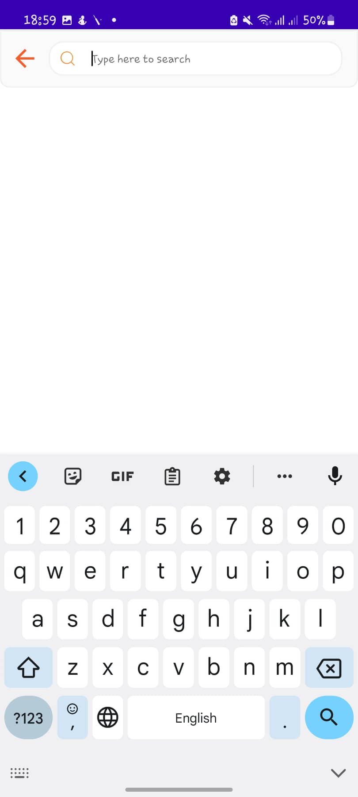
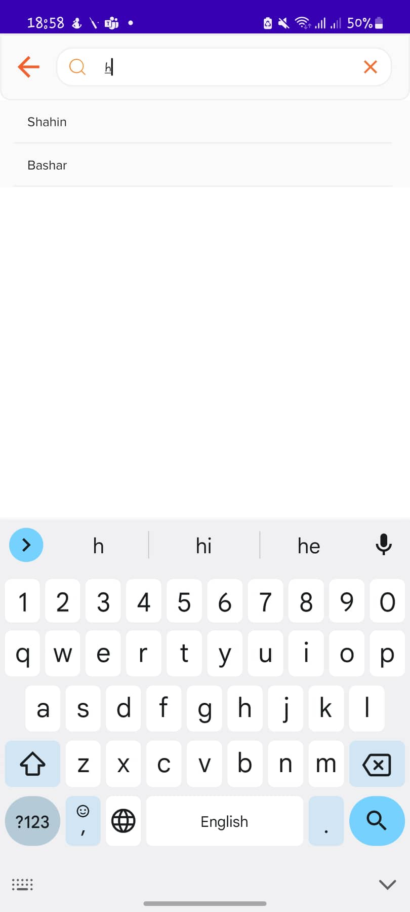

# SEARCH_VIEW_WITH_SUGGESTIONS

## Overview

SearchViewWithSuggestions is a simple Suggestions Widget from a String dataset that is developed by using Android SDK for getting your desired data easily.
First Screen | Second Screen
-------------|-----------------
 | 
## Set Up

To use this library, your project's minimum sdk version must be >= 21 and target/compile sdk version must be >=33.

    allprojects {
        repositories {
        ...
            maven { url 'https://jitpack.io' }
        }
    }

    dependencies {
        'com.github.sbiitju:search_view_with_suggestions:1.0.0'
    }

## Usage

### xml_code_sample

           <com.sbiitju.smart_search.SearchViewWithSuggestions
        android:id="@+id/searchViewWithSuggestions"
        android:layout_width="match_parent"
        android:layout_height="wrap_content"
        app:layout_constraintStart_toStartOf="parent"
        app:layout_constraintEnd_toEndOf="parent"
        app:layout_constraintTop_toTopOf="parent"
        />

### kotlin_code_sample

##Activity Class

            private lateinit var searchViewWithSuggestions: SearchViewWithSuggestions
            mainViewModel = ViewModelProvider(this)[MainViewModel::class.java]

            mainViewModel.searchResult.observe(this) {
            searchViewWithSuggestions.replaceSearchResult(it)
            }
            searchViewWithSuggestions = findViewById(R.id.searchViewWithSuggestions)

            searchViewWithSuggestions.searchViewAction =
            object : SearchViewWithSuggestions.SearchViewAction {
                override fun onReinitialize(editText: AppCompatEditText) {
                    mainViewModel.searchAddress("")
                }

                override fun onBackButtonClick(view: View) {
                    onBackPressed()
                }

                override fun onSearchQuery(query: String) {
                    mainViewModel.searchAddress(query)
                }

                override fun onResultItemClick(String: String) {
                    Toast.makeText(this@MainActivity, String, Toast.LENGTH_SHORT).show()
                }

            }

## ViewModel Class

    val searchResult = MutableLiveData<List<String>?>()
    val myList = ArrayList<String>()
    init {
        myList.add("Shahin")
        myList.add("Bashar")
        myList.add("Other Name")
    }
    fun searchAddress(query: String) {
        if (query == "") {
            searchResult.postValue(null)
        } else {
            searchResult.postValue(myList.filter {
                it.contains(query)
            })
        }
    }

